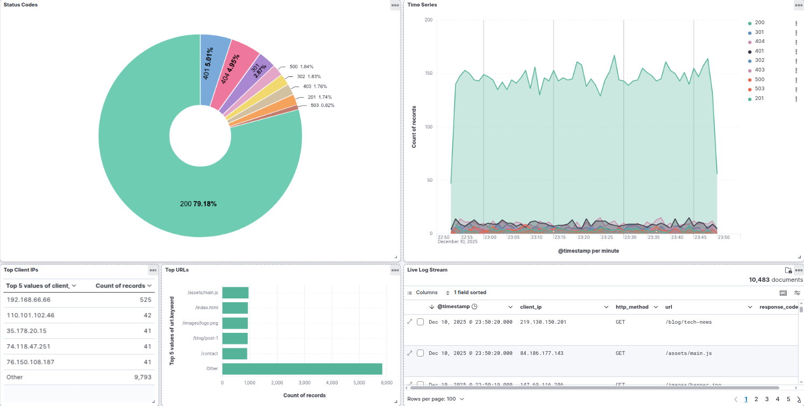
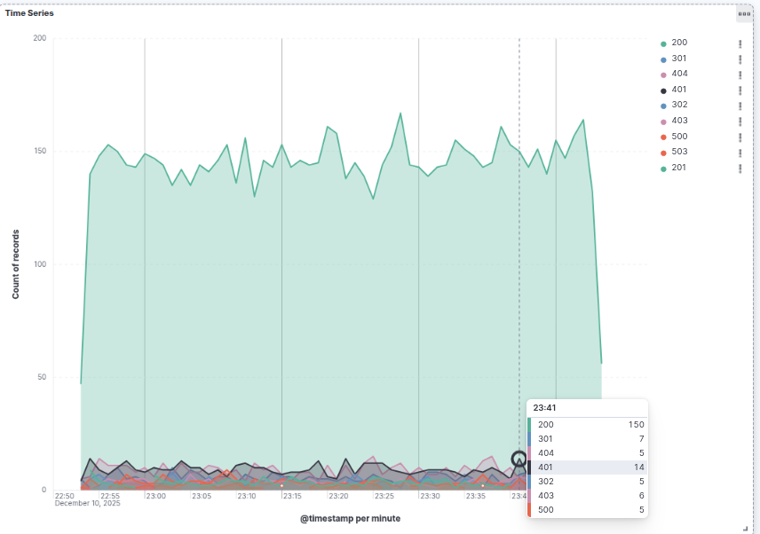
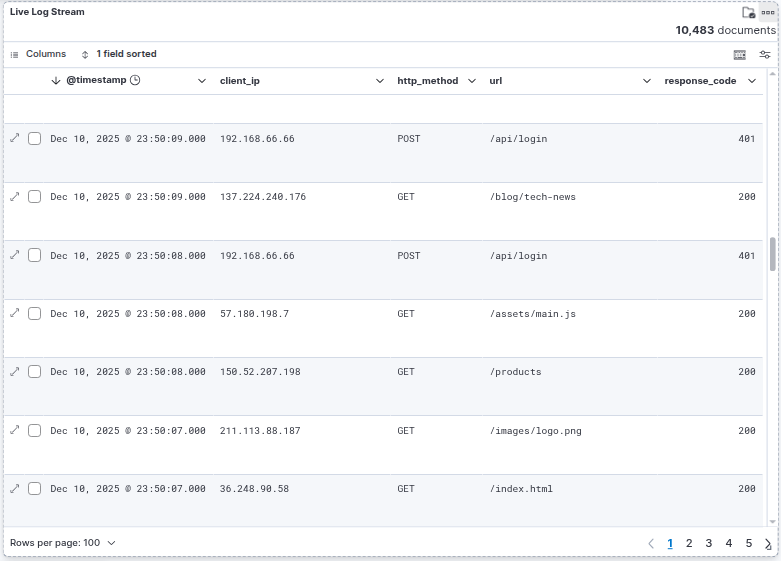

# Web Sunucusu Log Analizi ve İzleme Paneli

>  Bu proje, Aralık 2025 tarihinde *Büyük Veriye Giriş* dersi kapsamında geliştirilmiş olup, portfolyo arşivlemesi amacıyla GitHub'a sonradan aktarılmıştır.

## 1. Proje Özeti
Bu projede, yüksek trafikli bir web sunucusunu simüle eden log kayıtları üretilmiş ve bu veriler ELK Stack (Elasticsearch, Logstash, Kibana) kullanılarak analiz edilmiştir. Amaç, sunucu trafiğini işleyerek teknik personelin sistem durumunu ve olası anormallikleri (yüksek hata oranları, aşırı istekler) takip edebileceği bir izleme yapısı oluşturmaktır.

## 2. Kullanılan Mimari
Sistem Docker konteynerleri ile ayağa kaldırılmıştır.
- **Log Üretimi:** Python
- **Log İşleme:** Logstash 8.11.1
- **Veritabanı:** Elasticsearch 8.11.1
- **Arayüz:** Kibana 8.11.1

## 3. Uygulama Detayları

### 3.1. Veri Simülasyonu
Python kullanılarak Nginx formatında 10.000 satırlık log verisi üretilmiştir. Veri seti şu özellikleri içerir:
- **Normal Trafik:** İsteklerin %80'i belirli bir IP havuzundan gelmektedir.
- **Anomali Simülasyonu:** `192.168.66.66` IP adresinden `/api/login` noktasına sürekli POST isteği gönderilerek 401 (Yetkisiz) hatası üretilmiştir.
- **Zaman Damgası:** Veriler UTC (+0000) formatında üretilmiştir.

### 3.2. Veri İşleme (Logstash)
Log dosyası Logstash tarafından okunmuş ve Grok filtresi ile ayrıştırılmıştır.
- Log satırları IP, Tarih, Metot, URL ve Yanıt Kodu alanlarına bölünmüştür.
- Yanıt kodları (Response Code) sayısal veri tipine (integer) dönüştürülerek analiz edilebilir hale getirilmiştir.

### 3.3. Görselleştirme ve Analiz (Dashboard)
Kibana üzerinde oluşturulan dashboard, verilerin gerçek zamanlı izlenmesini sağlar. Aşağıda sistem çalışırken alınan ekran görüntüleri ve teknik analizleri yer almaktadır.

#### Genel Görünüm

*Şekil 1: Web Sunucu Analiz Paneli Genel Görünüm*

Dashboard üzerindeki bileşenlerin analizleri şöyledir:
- **HTTP Durum Kodu Dağılımı (Pie Chart):** Şekil 1'de sol üstte görülen grafik, yanıt kodlarını gösterir. Trafiğin %79'u başarılıdır (200 OK). Ancak %5.05 oranındaki 401 hataları, simüle edilen yetkisiz giriş denemelerini (brute-force) açıkça göstermektedir.
- **En Çok İstek Yapan IP'ler (Table):** Şekil 1'de sol altta yer alan tabloda, `192.168.66.66` IP adresinin istek sayısının normal kullanıcıların çok üzerinde olduğu tespit edilmiştir. Bu durum, saldırganın kaynağını doğrular.

#### Zaman Serisi ve Hata Analizi

*Şekil 2: Zamana Bağlı Trafik ve Hata Grafiği*

- **Analiz:** Yukarıdaki Şekil 2, trafiğin zaman içindeki değişimini gösterir. Grafikteki kırmızı ve turuncu alanlar (Hata kodları), normal akışın (Yeşil alan) üzerinde bir anomali katmanı oluşturarak saldırı anlarının görsel olarak tespit edilmesini sağlar.

#### Log Detay Görünümü

*Şekil 3: İşlenmiş Log Listesi*

- **Analiz:** Şüpheli durumların derinlemesine incelenmesi için Şekil 3'teki liste kullanılır. Burada saldırganın POST metodunu kullandığı ve sürekli 401 aldığı satır satır görülmektedir.

## 4. Sonuç
Proje ile ham log verileri anlamlı grafiklere dönüştürülmüştür. Oluşturulan yapı sayesinde, sunucudaki istek yoğunluğu ve hatalı yanıtlar teknik bir bakış açısıyla analiz edilebilir hale gelmiştir. Sistem Docker altyapısı sayesinde taşınabilir durumdadır.
